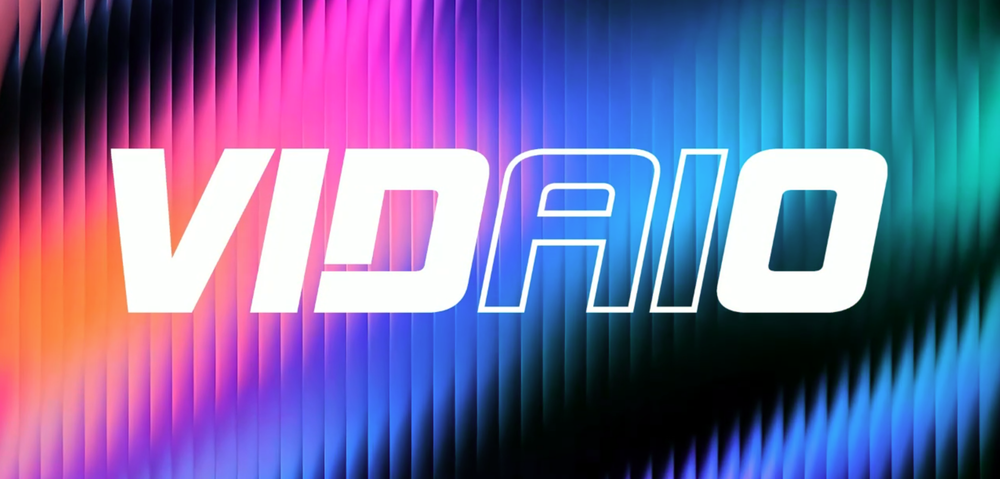

# **Vidaio Subnet**: Revolutionizing Video Processing with AI-Driven Decentralization <!-- omit in toc -->

Please check our [Tweet](https://x.com/vidaio_τ) to follow us.
[Website](https://vidaio.io)

 

---

## **Table of Contents**

1. [Introduction](#1-introduction)
2. [Subnet Architecture](#2-subnet-architecture)
   - [Overview](#21-overview)
   - [Miners](#22-miners)
   - [Validators](#23-validators)
   - [Synapses](#24-synapses)
     - [Synthetic Query](#241-synthetic-query)
     - [Organic Query](#242-organic-query)
3. [Setup](#3-setup)
4. [Roadmap](#4-roadmap)
5. [Appendix](#5-appendix)
   - [Technical Glossary](#a-technical-glossary)
   - [References](#b-references)
   - [Contact Information](#c-contact-information)

## **1. Introduction**
Vidaio's mission is to democratise video enhancement through decentralisation, artificial intelligence, and blockchain technology. Leveraging the Bittensor ecosystem, Vidaio provides creators, businesses, and developers with scalable, affordable, and high-quality video processing solutions including upscaling and compression, while ensuring full ownership and control over their content.

## 2. Subnet Architecture

### 2.1 Overview
- **Miners**: Handle video processing tasks including upscaling and compression, optimizing models to ensure high-quality outputs.
- **Validators**: Assess miner performance using predefined metrics to maintain network integrity across all video processing workflows.

### 2.2 Miners
Miners enhance video quality and optimize file sizes using AI-driven processing techniques. They can:
- Optimise open-source models or develop proprietary ones for superior upscaling and compression results.
- Handle video upscaling and compression requests from validators and end-users.
- Process both upscaling tasks (enhancing video quality) and compression tasks (reducing file size while maintaining quality).

### 2.3 Validators
Validators ensure miners deliver consistent, high-quality results by evaluating performance through synthetic and organic queries for both upscaling and compression workflows.

### 2.4 Synapses
#### 2.4.1 Synthetic Query
Validators benchmark miner performance using controlled datasets:
- **Upscaling**: Downscale a high-resolution video to low-resolution, then miners upscale it back to high resolution.
- **Compression**: Provide high-quality videos for miners to compress while maintaining optimal quality-to-size ratios.

- Validators assess the processed outputs using metrics VMAF and PieAPP for quality evaluation.

#### 2.4.2 Organic Query
Real-world video data uploaded by users is processed as follows:
- Videos are chunked and queued for miners.
- Miners process and apply upscaling or compression based on user requirements.
- Results are aggregated and delivered back to users.

### 2.5 Incentive mechanism
- [Incetive Mechanism Guide](docs/incentive_mechanism.md)

## 3. Setup
- [Validator Setup Guide](docs/validator_setup.md)
- [Miner Setup Guide](docs/miner_setup.md)

## 4. Roadmap

### Phase 1: Implementing the Video Processing Synapses
- Launch the subnet with AI-powered video upscaling and compression capabilities.
- Focus on real-time processing of videos for both quality enhancement and size optimization.

### Phase 2: Developing Advanced Video Processing Models
- Build AI models for adaptive bitrate streaming and intelligent compression.
- Optimize bandwidth usage while maintaining video quality across different use cases.

### Phase 3: Implementing the Transcode Optimization Synapse
- Introduce AI-driven transcoding for compatibility across devices.
- Evaluate miners on speed, quality, and efficiency for all processing workflows.

### Phase 4: On-Demand Streaming Architecture
- Enable decentralized on-demand video streaming with integrated storage.
- Utilize peer-to-peer (P2P) models for redundancy and high availability.

### Phase 5: Live Streaming Through the Subnet
- Introduce live streaming with real-time AI-powered upscaling, compression, and transcoding.
- Integrate adaptive bitrate streaming for smooth playback.

### Phase 6: Subnet API for Real-World Integration
- Develop a RESTful API for seamless integration with external platforms.
- Include features for uploading, processing, and retrieving videos with multiple processing options.

## 5. Appendix

### A. Technical Glossary
- **VMAF**: [Video Multimethod Assessment Fusion](https://github.com/vidaio-subnet/vmaf)
- **Video2x**: [Vidio upscaling model](https://github.com/vidaio-subnet/video2x)
- **TOPIQ**: [Top-down Image Quality Assessment](https://arxiv.org/pdf/2308.03060v1)
- **LPIPS**: [Learned Perceptual Image Patch Similarity](https://github.com/richzhang/PerceptualSimilarity)
- **Bittensor Subnet**: [Decentralized AI Framework](https://docs.bittensor.com)