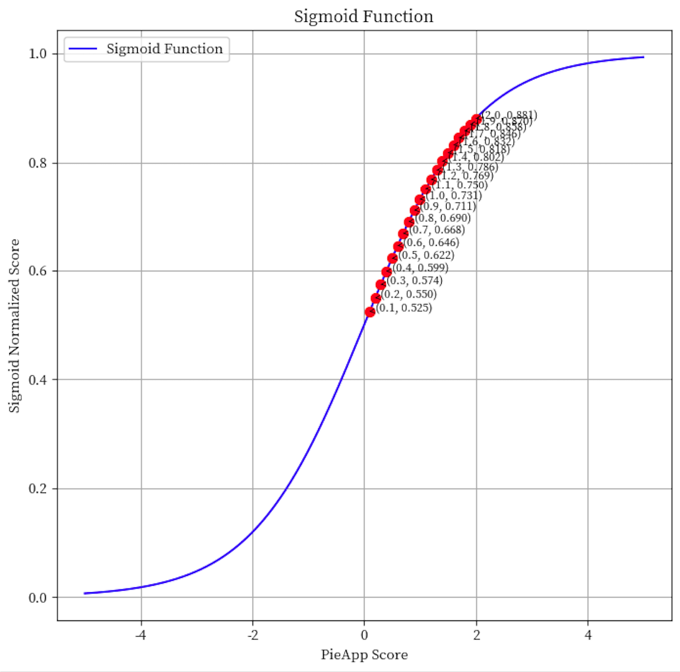
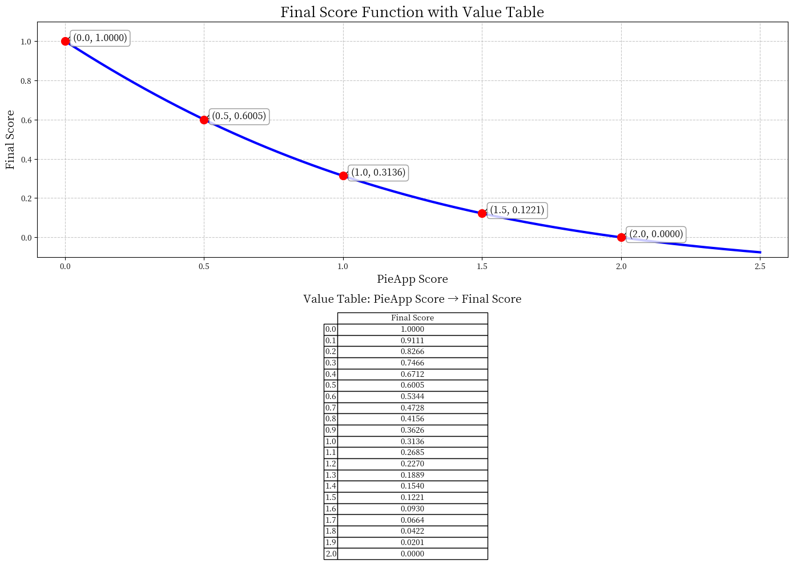
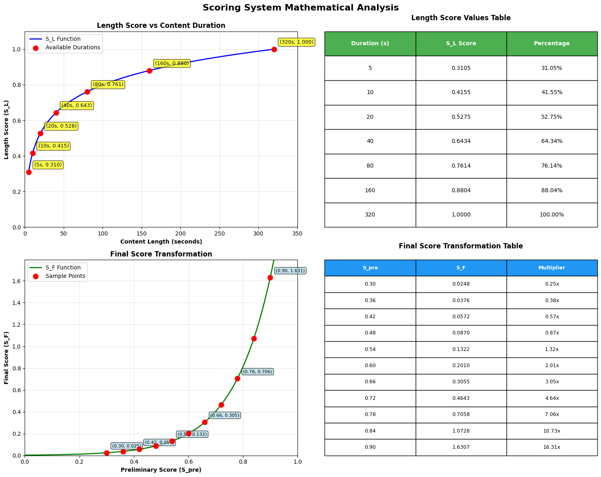
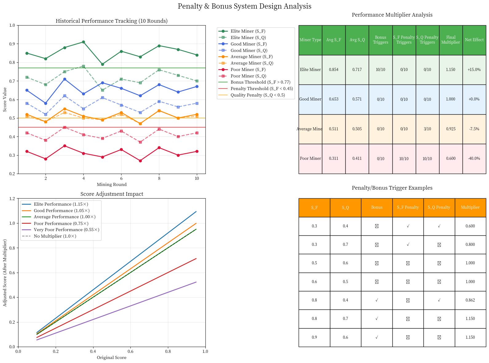
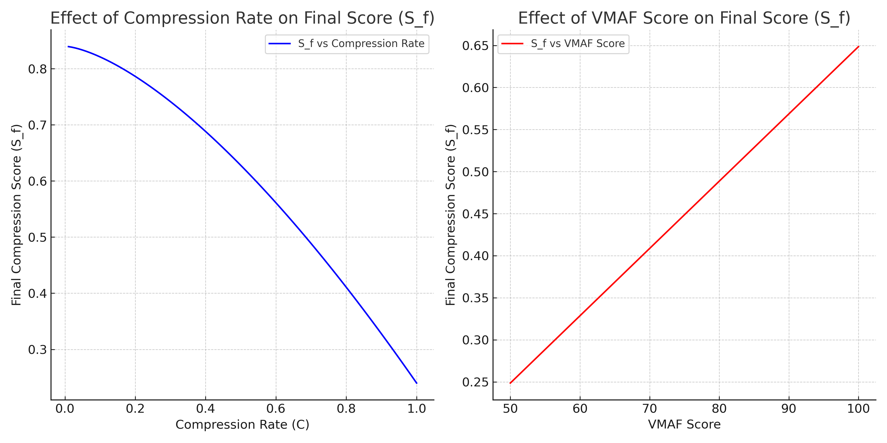

 # VIDAIO Subnet Validation & Incentive Mechanism

## Table of Contents
- [Overview](#overview)
- [Task Types](#task-types)
  - [Upscaling Tasks](#upscaling-tasks)
  - [Compression Tasks](#compression-tasks)
- [Quality Validation Metrics](#quality-validation-metrics)
  - [VMAF (Video Multi-Method Assessment Fusion)](#vmaf-video-multi-method-assessment-fusion)
  - [PIE-APP (Perceptual Image-Error Assessment)](#pie-app-perceptual-image-error-assessment-through-pairwise-preference)
- [Upscaling System](#upscaling-system)
  - [Upscaling Scoring](#upscaling-scoring)
  - [Content Length Scoring](#content-length-scoring)
  - [Upscaling Final Score](#upscaling-final-score)
  - [Upscaling Penalty & Bonus System](#upscaling-penalty--bonus-system)
- [Compression System](#compression-system)
  - [Compression Scoring](#compression-scoring)
  - [Compression Penalty & Bonus System](#compression-penalty--bonus-system)
- [Implementation Guidelines](#implementation-guidelines)
- [Technical Specifications](#technical-specifications)
- [Mathematical Properties](#mathematical-properties)

---

## Overview

The VIDAIO subnet validation mechanism ensures quality and reliability of miners' contributions through comprehensive assessment systems for different video processing tasks. The mechanism evaluates video processing performance using industry-standard **VMAF** and **PIE-APP** metrics, combined with advanced scoring systems that reward consistency and penalize poor performance.

**Key Features:**
- 🎯 **Multi-task support** for upscaling and compression operations
- 📊 **Quality validation** using industry-standard VMAF and PIE-APP metrics
- 🏆 **Performance-based incentive systems** with exponential rewards
- 📈 **Historical performance tracking** with rolling 10-round windows
- ⚖️ **Balanced penalty/bonus multipliers** encouraging sustained excellence
- 📦 **Dynamic content processing** (5s to 320s capability)

---

## Task Types

### Upscaling Tasks

Upscaling tasks require miners to enhance video quality by increasing resolution while maintaining or improving visual fidelity. These tasks focus on **quality improvement** as the primary objective.

**Key Characteristics:**
- **Primary Goal**: Quality enhancement and resolution improvement
- **Quality Metrics**: PIE-APP for scoring, VMAF for threshold validation
- **Content Length**: Dynamic processing durations (5s to 320s)
- **Scoring Focus**: Quality improvement with content length consideration

### Compression Tasks

Compression tasks require miners to reduce video file sizes while maintaining quality above specified VMAF thresholds. These tasks focus on **efficiency optimization** balancing file size reduction with quality preservation.

**Key Characteristics:**
- **Primary Goal**: File size reduction with quality maintenance
- **Quality Metrics**: VMAF for both scoring and threshold validation
- **Compression Rate**: File size reduction efficiency measurement
- **Scoring Focus**: Compression efficiency with quality threshold compliance

---

## Quality Validation Metrics

### VMAF (Video Multi-Method Assessment Fusion)

VMAF serves as the foundational video quality assessment metric, comparing frame-by-frame quality between original and processed videos. This metric provides objective measurement of subjective video quality as perceived by humans.

#### Key Characteristics
- **Purpose**: Frame-by-frame quality comparison
- **Range**: 0-100 (higher values indicate better quality)
- **Usage**: Threshold validation and quality scoring
- **Industry Standard**: Widely adopted in professional video processing

#### Mathematical Implementation

**Harmonic Mean Calculation:**
```
H = n / (1/S_1 + 1/S_2 + ... + 1/S_n)
```

**Where:**
- `S_i`: VMAF score for frame `i` (i = 1, 2, ..., n)
- `n`: Total number of frames in the video
- `H`: Harmonic mean emphasizing poor-quality frame impact

#### Why Harmonic Mean?

The harmonic mean approach provides several critical advantages:

| Advantage | Description | Impact |
|-----------|-------------|---------|
| **Sensitivity to Low Values** | Heavily penalizes poor-quality frames | Ensures consistent quality |
| **Quality Consistency** | Prevents miners from neglecting frame quality | Maintains processing standards |
| **Threshold Function** | Validates authentic processing processes | Prevents gaming attempts |

> **Note**: VMAF scores are calculated using 5 random frames for both upscaling and compression tasks.

---

### PIE-APP (Perceptual Image-Error Assessment through Pairwise Preference)

PIE-APP provides deep learning-based perceptual similarity assessment between original and processed video frames, serving as the primary quality scoring mechanism for upscaling tasks.

#### Technical Specifications

| Parameter | Value | Description |
|-----------|-------|-------------|
| **Scale Range** | (-∞, ∞) | Theoretical range |
| **Practical Range** | 0 to 5+ | Positive values (lower = better) |
| **Processing Interval** | Every frame | Default frame sampling rate |
| **Implementation** | Deep learning-based | Advanced perceptual assessment |

#### Calculation Process

**Step 1: Raw PIE-APP Score**
```
PIE-APP_score = (Σ abs(d(F_i, F'_i))) / n
```

**Where:**
- `F_i`: Frame `i` from original video
- `F'_i`: Corresponding frame `i` from processed video  
- `d(F_i, F'_i)`: Perceptual difference between frames
- `n`: Number of processed frames (4 random frames)

**Step 2: Score Normalization**
```
1. Cap values: max(Average_PIE-APP, 2.0)
2. Sigmoid normalization: normalized_score = 1/(1+exp(-Average_PIE-APP))
3. Final transformation: Convert "lower is better" to "higher is better" (0-1 range)
```

#### Visual Score Transformation

The PIE-APP scoring system uses sophisticated mathematical transformations:

- *Sigmoid normalization function for PIE-APP scores*
!

- *Final score transformation converting to 0-1 range*
!

---

## Upscaling System

### Upscaling Scoring

#### Quality Score Calculation

**VMAF Threshold Validation:**
```
If VMAF_score < VMAF_threshold:
    S_Q = 0 (Zero score for quality violation)
Else:
    S_Q = PIE-APP_Final_Score
```

**Where:**
- `S_Q`: Quality score for upscaling
- `VMAF_score`: Achieved VMAF quality score
- `VMAF_threshold`: Minimum required VMAF score
- `PIE-APP_Final_Score`: Normalized PIE-APP score (0-1 range)

#### Metric Integration

| Metric | Range | Primary Function | Usage |
|--------|-------|------------------|-------|
| **VMAF** | 0-100 | Threshold validation | Upscaling verification |
| **PIE-APP** | 0-1 (final) | Quality scoring | Performance evaluation |

---

### Content Length Scoring

#### Dynamic Content Length Requests

Miners actively request content processing durations within 35-second evaluation windows, enabling optimized resource allocation and performance assessment.

#### Available Processing Durations

| Duration | Status | Availability |
|----------|--------|--------------|
| 5s | ✅ Default | Currently Available |
| 10s | ✅ Available | Currently Available |
| 20s | 🔄 Coming Soon | Future Release |
| 40s | 🔄 Coming Soon | Future Release |
| 80s | 🔄 Coming Soon | Future Release |
| 160s | 🔄 Coming Soon | Future Release |
| 320s | 🔄 Coming Soon | Future Release |

> **Current Limitation**: Processing durations up to 10 seconds are currently supported.

#### Length Score Mathematical Model

**Formula:**
```
S_L = log(1 + content_length) / log(1 + 320)
```

**Parameters:**
- `content_length`: Processing duration in seconds
- `S_L`: Normalized length score (0 to 1)

#### Performance Analysis Table

| Duration (s) | S_L Score | Percentage | Improvement | Performance Tier |
|--------------|-----------|------------|-------------|------------------|
| 5 | 0.3105 | 31.05% | Baseline | Default |
| 10 | 0.4155 | 41.55% | +33% | Significant Gain |
| 20 | 0.5275 | 52.75% | +27% | Strong Performance |
| 40 | 0.6434 | 64.34% | +22% | High Capability |
| 80 | 0.7614 | 76.14% | +18% | Advanced Processing |
| 160 | 0.8804 | 88.04% | +16% | Expert Level |
| 320 | 1.0000 | 100.00% | +14% | Maximum Score |

#### Logarithmic Scaling Benefits

| Benefit | Description | Impact |
|---------|-------------|---------|
| **Fair Distribution** | Balanced scoring across duration ranges | Equitable competition |
| **Diminishing Returns** | Reduced gains for extreme durations | Prevents over-optimization |
| **Normalized Output** | Consistent 0-1 scoring range | Standardized evaluation |
| **Capacity Recognition** | Rewards longer processing capabilities | Incentivizes advancement |

**Strategic Insights:**
- **Optimal Entry Point**: 10s processing provides largest relative improvement (+33%)
- **Scaling Pattern**: Each duration doubling yields progressively smaller benefits
- **Maximum Achievement**: 320s processing represents theoretical performance ceiling

---

### Upscaling Final Score

#### Score Component Architecture

The comprehensive upscaling scoring system integrates two fundamental metrics:

| Component | Symbol | Description | Weight |
|-----------|--------|-------------|--------|
| **Quality Score** | S_Q | Processing accuracy and output quality | W1 = 0.5 |
| **Length Score** | S_L | Content processing capacity | W2 = 0.5 |

#### Preliminary Score Calculation

**Formula:**
```
S_pre = S_Q × W1 + S_L × W2
```

**Current Configuration:**
- `W1 = 0.5` (Quality weight)
- `W2 = 0.5` (Length weight)

> **Dynamic Adjustment**: Weights are continuously optimized based on real-world performance data and network requirements.

#### Final Score Transformation

The preliminary score undergoes exponential transformation for enhanced performance differentiation:

**Formula:**
```
S_F = 0.1 × e^(6.979 × (S_pre - 0.5))
```

**Parameters:**
- `S_F`: Final upscaling score
- `S_pre`: Preliminary combined score
- `e`: Euler's number (≈2.718)

#### Performance Tier Analysis

| S_pre | S_F Score | Multiplier | Performance Tier | Reward Category |
|-------|-----------|------------|------------------|-----------------|
| 0.30 | 0.0248 | 0.25× | Poor Performance | Significant Penalty |
| 0.36 | 0.0376 | 0.38× | Below Average | Moderate Penalty |
| 0.42 | 0.0572 | 0.57× | Low Average | Minor Penalty |
| 0.48 | 0.0870 | 0.87× | Near Average | Slight Penalty |
| 0.54 | 0.1322 | 1.32× | Above Average | Moderate Reward |
| 0.60 | 0.2010 | 2.01× | Good Performance | Strong Reward |
| 0.66 | 0.3055 | 3.05× | High Performance | Major Reward |
| 0.72 | 0.4643 | 4.64× | Very High Performance | Excellent Reward |
| 0.78 | 0.7058 | 7.06× | Excellent Performance | Outstanding Reward |
| 0.84 | 1.0728 | 10.73× | Outstanding Performance | Elite Reward |
| 0.90 | 1.6307 | 16.31× | Elite Performance | Maximum Reward |

#### Exponential Function Characteristics

**System Benefits:**
| Feature | Description | Strategic Impact |
|---------|-------------|------------------|
| **Enhanced Differentiation** | Clear performance tier separation | Competitive advantage clarity |
| **Reward Amplification** | 16× multiplier difference (top vs bottom) | Strong performance incentives |
| **Competitive Optimization** | Non-linear improvement rewards | Encourages continuous advancement |
| **Exponential Scaling** | Small S_pre gains yield large S_F improvements | High-performance focus |

**Strategic Performance Guidelines:**
- **Minimum Target**: Achieve S_pre > 0.6 for meaningful reward activation
- **Optimization Focus**: Exponential curve creates powerful excellence incentives
- **High-Performance Strategy**: Small quality improvements at elevated levels yield disproportionate benefits

#### Graph Analysis

!

---

### Upscaling Penalty & Bonus System

#### Historical Performance Multiplier Architecture

The advanced upscaling scoring system incorporates a **rolling 10-round historical performance window** to evaluate consistency patterns and apply dynamic multipliers based on sustained performance trends.

#### System Formula

```
Final Adjusted Score = S_F × Performance Multiplier
Performance Multiplier = Bonus Multiplier × S_F Penalty × S_Q Penalty
```

---

#### Bonus System (Excellence Rewards)

**Activation Criteria:** `S_F > 0.32` in mining round

**Mathematical Model:**
```python
bonus_multiplier = 1.0 + (bonus_count / 10) × 0.15
```

**System Characteristics:**
| Parameter | Value | Description |
|-----------|-------|-------------|
| **Maximum Bonus** | +15% | All 10 rounds achieve S_F > 0.32 |
| **Scaling Method** | Linear | Based on consistency frequency |
| **Primary Purpose** | Sustained excellence reward | Long-term performance incentive |

**Example Calculation:** 7/10 rounds with S_F > 0.32 → 1.105× multiplier (+10.5% bonus)

---

#### S_F Penalty System (Performance Penalties)

**Activation Criteria:** `S_F < 0.20` in mining round

**Mathematical Model:**
```python
penalty_f_multiplier = 1.0 - (penalty_f_count / 10) × 0.20
```

**System Characteristics:**
| Parameter | Value | Description |
|-----------|-------|-------------|
| **Maximum Penalty** | -20% | All 10 rounds achieve S_F < 0.20 |
| **Scaling Method** | Linear | Based on poor performance frequency |
| **Primary Purpose** | Performance consistency enforcement | Discourages sustained poor results |

**Example Calculation:** 4/10 rounds with S_F < 0.20 → 0.92× multiplier (-8% penalty)

---

#### S_Q Penalty System (Quality Penalties)

**Activation Criteria:** `S_Q < 0.25` in mining round

**Mathematical Model:**
```python
penalty_q_multiplier = 1.0 - (penalty_q_count / 10) × 0.25
```

**System Characteristics:**
| Parameter | Value | Description |
|-----------|-------|-------------|
| **Maximum Penalty** | -25% | All 10 rounds achieve S_Q < 0.25 |
| **Scaling Method** | Linear | Based on quality failure frequency |
| **Primary Purpose** | Quality standard enforcement | Strongest penalty (quality is critical) |

**Example Calculation:** 3/10 rounds with S_Q < 0.25 → 0.925× multiplier (-7.5% penalty)

---

#### Performance Multiplier Case Studies

| Miner Category | Avg S_F | Avg S_Q | Bonus Rate | S_F Penalty | S_Q Penalty | **Final Multiplier** | **Net Effect** |
|----------------|---------|---------|------------|-------------|-------------|---------------------|----------------|
| **Elite Miner** | 0.854 | 0.717 | 10/10 | 0/10 | 0/10 | **1.150×** | **+15.0%** |
| **Good Miner** | 0.653 | 0.571 | 0/10 | 0/10 | 0/10 | **1.000×** | **±0.0%** |
| **Average Miner** | 0.511 | 0.505 | 0/10 | 0/10 | 3/10 | **0.925×** | **-7.5%** |
| **Poor Miner** | 0.311 | 0.411 | 0/10 | 10/10 | 10/10 | **0.600×** | **-40.0%** |

#### Penalty Analysis

!

---

#### System Benefits & Strategic Impact

**Core System Benefits:**

| Benefit | Description | Strategic Impact |
|---------|-------------|------------------|
| 🎯 **Consistency Rewards** | Elite miners maintain sustained +15% bonus | Long-term competitive advantage |
| ⚡ **Responsive Penalties** | Poor performance accumulates immediate penalties | Rapid feedback mechanism |
| 🔄 **Recovery Incentive** | Miners can improve multipliers over 10 rounds | Encourages continuous improvement |
| ⚖️ **Balanced Impact** | Quality penalties are strongest (-25% max) | Emphasizes quality importance |
| 📈 **Progressive Scaling** | Linear scaling prevents extreme swings | Maintains system stability |

---

## Compression System

### Compression Scoring

#### Task Parameters

Each compression task includes specific requirements:

| Parameter | Description | Range | Impact |
|-----------|-------------|-------|---------|
| **VMAF Threshold** | Minimum acceptable quality score | 0-100 | Quality validation |
| **Original File Size** | Baseline for compression calculation | Variable | Compression rate baseline |
| **Target Optimization** | Balance between compression and quality | Dynamic | Performance strategy |

#### Compression Rate Calculation

**Formula:**
```
C = compressed_file_size / original_file_size
```

**Where:**
- `C`: Compression rate (0 < C ≤ 1)
- `compressed_file_size`: Size of processed video file
- `original_file_size`: Size of original video file

**Characteristics:**
- **Lower C values** indicate better compression (smaller files)
- **C = 1.0** means no compression achieved
- **C < 1.0** indicates successful compression

#### VMAF Quality Assessment

**Implementation:**
```
VMAF_score = Harmonic_Mean(VMAF_frame_1, VMAF_frame_2, ..., VMAF_frame_n)
```

**Where:**
- `VMAF_frame_i`: VMAF score for frame `i`
- `n`: Number of sampled frames (5 random frames)
- `Harmonic_Mean`: Emphasizes poor-quality frame impact

#### Final Compression Score Calculation

**Threshold Validation:**
```
If VMAF_score < VMAF_threshold:
    S_f = 0 (Zero score for quality violation)
Else:
    S_f = w_c × (1 - C^1.5) + w_vmaf × (VMAF_score - VMAF_threshold) / (100 - VMAF_threshold)
```

**Parameters:**
- `S_f`: Final compression score
- `w_c`: Weight for compression rate (default: 0.8)
- `w_vmaf`: Weight for VMAF score (default: 0.2)
- `C`: Compression rate
- `VMAF_score`: Achieved VMAF quality score
- `VMAF_threshold`: Minimum required VMAF score

#### Mathematical Properties

**Compression Rate Component:**
- **Formula**: `w_c × (1 - C^1.5)`
- **Range**: [0, w_c] (0 when C = 1, w_c when C = 0)
- **Curve**: Concave function emphasizing compression efficiency
- **Exponent 1.5**: Provides balanced reward for compression achievements

**VMAF Quality Component:**
- **Formula**: `w_vmaf × (VMAF_score - VMAF_threshold) / (100 - VMAF_threshold)`
- **Range**: [0, w_vmaf] (0 at threshold, w_vmaf at maximum quality)
- **Normalization**: Scales quality improvement relative to achievable range
- **Linear scaling**: Direct correlation between quality improvement and score

#### Graph Analysis

!

---

#### Performance Analysis Examples

| Scenario | C | VMAF_score | VMAF_threshold | S_f | Performance Tier |
|----------|---|------------|----------------|-----|------------------|
| **Excellent** | 0.3 | 85 | 70 | 0.669 + 0.100 = **0.769** | Outstanding |
| **Good** | 0.5 | 80 | 70 | 0.517 + 0.067 = **0.584** | Strong |
| **Average** | 0.7 | 75 | 70 | 0.331 + 0.033 = **0.364** | Acceptable |
| **Poor Quality** | 0.4 | 65 | 70 | **0.000** | Failed |
| **No Compression** | 1.0 | 90 | 70 | 0.000 + 0.133 = **0.133** | Inefficient |

#### Strategic Guidelines

| Miner Strategy | Focus Area | Target Metrics | Expected Outcome |
|----------------|------------|---------------|------------------|
| **Quality-First** | Maintain high VMAF scores | VMAF_score >> VMAF_threshold | Consistent moderate scores |
| **Compression-First** | Maximize file size reduction | C << 1.0 | Variable scores based on quality |
| **Balanced Approach** | Optimize both factors | Moderate C + Good VMAF | Optimal long-term performance |
| **Threshold Gaming** | Minimal quality compliance | VMAF_score ≈ VMAF_threshold | Low scores, high risk |

---

### Compression Penalty & Bonus System

#### Historical Performance Multiplier Architecture

The compression scoring system incorporates a **rolling 10-round historical performance window** to evaluate consistency patterns and apply dynamic multipliers based on sustained performance trends.

#### System Formula

```
Final Adjusted Compression Score = S_f × Performance Multiplier
Performance Multiplier = Bonus Multiplier × S_f Penalty × VMAF Penalty
```

---

#### Bonus System (Excellence Rewards)

**Activation Criteria:** `S_f > 0.74` in compression mining round

**Mathematical Model:**
```python
bonus_multiplier = 1.0 + (bonus_count / 10) × 0.15
```

**System Characteristics:**
| Parameter | Value | Description |
|-----------|-------|-------------|
| **Maximum Bonus** | +15% | All 10 rounds achieve S_f > 0.74 |
| **Scaling Method** | Linear | Based on consistency frequency |
| **Primary Purpose** | Sustained excellence reward | Long-term performance incentive |

**Example Calculation:** 7/10 rounds with S_f > 0.74 → 1.105× multiplier (+10.5% bonus)

---

#### S_f Penalty System (Performance Penalties)

**Activation Criteria:** `S_f < 0.4` in compression mining round

**Mathematical Model:**
```python
penalty_f_multiplier = 1.0 - (penalty_f_count / 10) × 0.20
```

**System Characteristics:**
| Parameter | Value | Description |
|-----------|-------|-------------|
| **Maximum Penalty** | -20% | All 10 rounds achieve S_f < 0.4 |
| **Scaling Method** | Linear | Based on poor performance frequency |
| **Primary Purpose** | Performance consistency enforcement | Discourages sustained poor results |

**Example Calculation:** 4/10 rounds with S_f < 0.4 → 0.92× multiplier (-8% penalty)

---

#### Compression Performance Multiplier Case Studies

| Miner Category | Avg S_f | Avg VMAF Margin | Bonus Rate | S_f Penalty | **Final Multiplier** | **Net Effect** |
|----------------|---------|-----------------|------------|-------------|---------------|---------------------|----------------|
| **Elite Compressor** | 0.654 | +15 | 10/10 | 0/10 | **1.150×** | **+15.0%** |
| **Good Compressor** | 0.453 | +8 | 0/10 | 0/10 | **1.000×** | **±0.0%** |
| **Average Compressor** | 0.311 | +3 | 0/10 | 0/10 | **0.910×** | **-9.0%** |
| **Poor Compressor** | 0.211 | -2 | 0/10 | 10/10 | **0.490×** | **-51.0%** |

#### Compression Penalty Analysis

**Strategic Impact:**
- **Quality-first approach** strongly incentivized through higher penalties
- **Consistency rewards** for miners maintaining quality above threshold
- **Immediate feedback** through zero-score for quality violations
- **Balanced optimization** encouraged through dual-factor scoring

---

## Implementation Guidelines

### Performance Monitoring

**Real-time Operations:**
- ✅ Scores calculated in real-time during mining operations
- ✅ Historical performance data maintained for trend analysis and multiplier calculation
- ✅ Weight adjustments implemented based on network-wide performance metrics
- ✅ Performance multipliers updated after each mining round

### Scoring Strategy Recommendations

**Upscaling Performance-Based Guidelines:**

| Miner Category | Primary Focus | Strategic Recommendations |
|----------------|---------------|---------------------------|
| **New Miners** | Foundation Building | Focus on achieving consistent S_pre > 0.5 before optimizing for length |
| **Established Miners** | Quality Optimization | Prioritize quality improvements when S_pre > 0.6 to avoid S_Q penalties |
| **Elite Miners** | Consistency Maintenance | Maintain consistency above S_F > 0.32 to secure maximum bonus multipliers |
| **Recovery Phase** | Systematic Improvement | Focus on quality (S_Q > 0.25) first, then performance (S_F > 0.20) to restore multipliers |

**Compression Performance-Based Guidelines:**

| Miner Category | Primary Focus | Strategic Recommendations |
|----------------|---------------|---------------------------|
| **New Compressors** | Quality Compliance | Focus on maintaining VMAF_score > VMAF_threshold + 5 |
| **Established Compressors** | Balanced Optimization | Optimize both compression rate and quality maintenance |
| **Elite Compressors** | Consistency Excellence | Maintain S_f > 0.74 consistently for bonus multipliers |
| **Recovery Phase** | Quality Restoration | Focus on VMAF compliance first, then compression optimization |

### Future Enhancement Roadmap

**Planned Developments:**

- [ ] **Extended Content Length Support** - Processing durations up to 320s
- [ ] **Dynamic Weight Adjustment Algorithms** - Automated optimization based on network performance
- [ ] **Advanced Quality Metrics Integration** - Additional assessment parameters
- [ ] **Multi-dimensional Scoring Parameters** - Enhanced evaluation criteria
- [ ] **Adaptive Difficulty Scaling** - Network performance-based adjustments
- [ ] **Advanced Penalty/Bonus Optimization** - Network-wide performance distribution analysis
- [ ] **Seasonal Performance Multiplier Adjustments** - Time-based optimization cycles
- [ ] **Cross-Task Performance Integration** - Unified scoring across upscaling and compression

---

## Technical Specifications

### Core System Parameters

| Parameter | Current Value | Configurable Range | Implementation Notes |
|-----------|---------------|-------------------|---------------------|
| **Default Content Length** | 5s | 5s - 10s | Actively configurable by miners |
| **Quality Weight (W1)** | 0.5 | 0.0 - 1.0 | Dynamically adjusted based on network data |
| **Length Weight (W2)** | 0.5 | 0.0 - 1.0 | Dynamically adjusted based on network data |

### Compression System Parameters

| Parameter | Current Value | Configurable Range | Implementation Notes |
|-----------|---------------|-------------------|---------------------|
| **Compression Rate Weight (w_c)** | 0.8 | 0.6 - 0.9 | Balances compression efficiency vs quality |
| **VMAF Score Weight (w_vmaf)** | 0.2 | 0.1 - 0.4 | Balances quality maintenance vs compression |
| **Compression Rate Exponent** | 1.5 | 1.2 - 2.0 | Controls compression reward curve steepness |
| **VMAF Safety Margin** | +5 | +3 - +10 | Quality buffer above threshold |
| **Zero-Score Threshold** | VMAF_score < VMAF_threshold | Fixed | Immediate penalty for quality violations |

### Performance Multiplier System Parameters

| Parameter | Current Value | Configurable Range | System Impact |
|-----------|---------------|-------------------|---------------|
| **Performance History Window** | 10 rounds | 5-10 rounds | Configurable for different network conditions |
| **Upscaling Bonus Threshold** | S_F > 0.32 | 0.3-0.4 | Adjustable based on network performance |
| **Upscaling S_F Penalty Threshold** | S_F < 0.20 | 0.15-0.25 | Adjustable based on network performance |
| **Upscaling S_Q Penalty Threshold** | S_Q < 0.25 | 0.2-0.3 | Adjustable based on network performance |
| **Compression Bonus Threshold** | S_f > 0.74 | 0.7-0.8 | Lower threshold reflecting compression difficulty |
| **Compression S_f Penalty Threshold** | S_f < 0.4 | 0.35-0.45 | Penalty for poor compression performance |
| **VMAF Penalty Threshold** | VMAF_score < VMAF_threshold + 5 | +3 to +10 | Quality safety margin enforcement |
| **Maximum Bonus** | +15% | 10%-20% | Scalable reward system |
| **Maximum S_F Penalty** | -20% | 15%-25% | Scalable penalty system |
| **Maximum S_Q Penalty** | -25% | 20%-30% | Strongest penalty for quality issues |

---

## Mathematical Properties

### Upscaling Length Score Function Properties

**Mathematical Characteristics:**
- **Domain**: [5, 320] seconds
- **Range**: [0.3105, 1.0000]
- **Function Type**: Logarithmic (concave)
- **Growth Rate**: Decreasing marginal returns
- **Optimization Point**: Balanced between processing capability and diminishing returns

### Upscaling Final Score Function Properties

**Mathematical Characteristics:**
- **Domain**: [0, 1] (S_pre values)
- **Range**: [0.0025, 40.43] (theoretical maximum)
- **Function Type**: Exponential (convex)
- **Critical Point**: S_pre = 0.5 (inflection point for reward/penalty)
- **Scaling Behavior**: Exponential amplification of performance differences

### Compression Score Function Properties

**Mathematical Characteristics:**
- **Domain**: [0, 1] (compression rate C values)
- **Range**: [0, w_c] (compression component score)
- **Function Type**: Concave (1 - C^1.5)
- **Critical Point**: C = 1 (no compression = zero score)
- **Optimization**: Lower C values yield higher scores with diminishing returns

### Compression VMAF Component Properties

**Mathematical Characteristics:**
- **Domain**: [VMAF_threshold, 100] (achievable quality range)
- **Range**: [0, w_vmaf] (quality component score)
- **Function Type**: Linear normalization
- **Zero Point**: VMAF_score = VMAF_threshold
- **Maximum Point**: VMAF_score = 100
- **Quality Buffer**: +5 margin for penalty system

### Performance Multiplier Properties

**Mathematical Characteristics:**
- **Domain**: [0.55, 1.15] (practical operational range)
- **Function Type**: Linear combination of historical performance frequencies
- **Update Frequency**: After each mining round completion
- **Memory System**: Rolling 10-round window with automatic history management
- **Convergence**: Stabilizes after 10 rounds of consistent performance patterns

---

## Conclusion

The VIDAIO subnet validation and incentive mechanism represents a comprehensive, mathematically-grounded approach to ensuring high-quality video processing while maintaining fair competition and encouraging continuous improvement. Through the integration of industry-standard metrics (VMAF and PIE-APP), dynamic scoring systems, and sophisticated penalty/bonus mechanisms, the system creates a robust environment that rewards excellence and consistency while providing clear pathways for improvement.

The system now supports both **upscaling** and **compression** tasks, each with specialized scoring mechanisms:
- **Upscaling tasks** focus on quality improvement using PIE-APP scoring with VMAF threshold validation
- **Compression tasks** balance file size reduction with quality maintenance using dual-factor scoring
- **Unified penalty systems** ensure consistent quality standards across all task types

These metrics together ensure that miners maintain high-quality video processing standards while meeting demands for fast and efficient processing, creating a sustainable and competitive ecosystem for video enhancement and optimization services.

---

*This documentation is continuously updated to reflect the latest scoring mechanisms, performance optimizations, and system enhancements.*