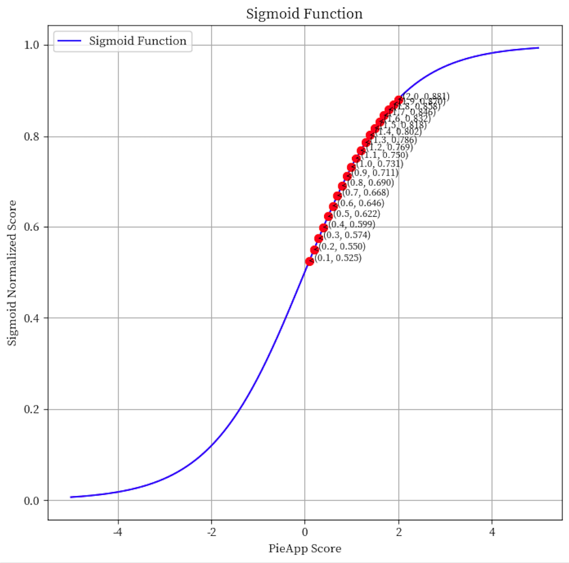
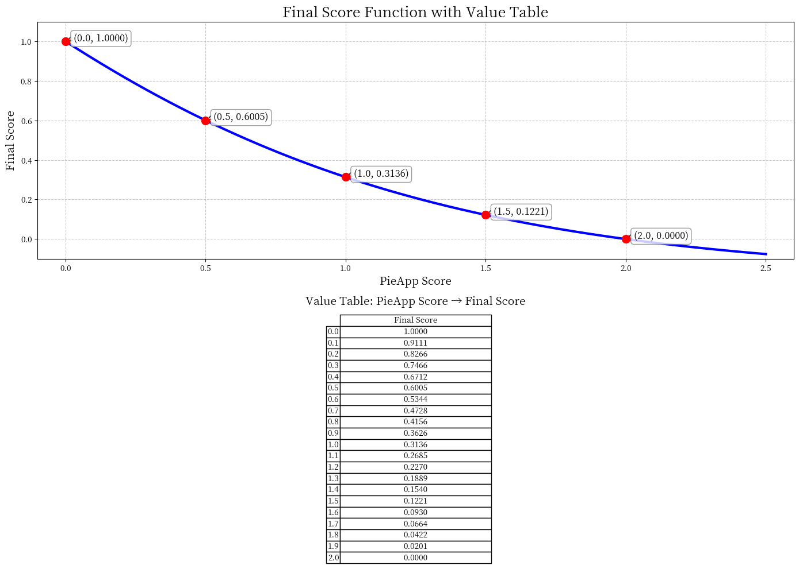
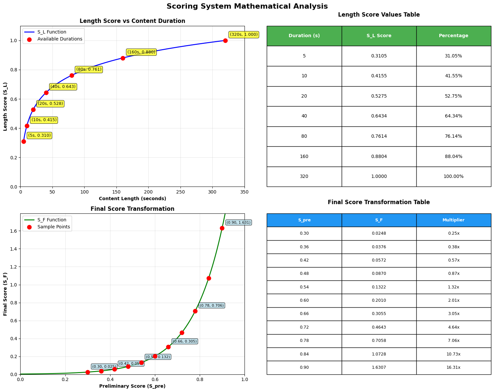
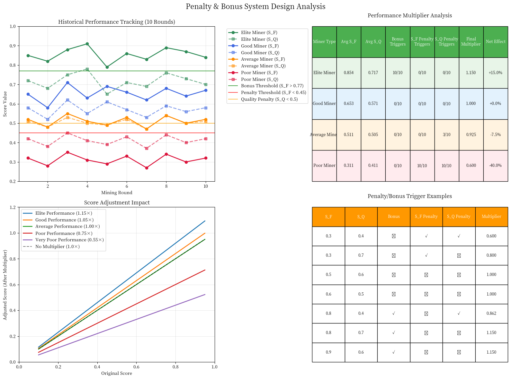
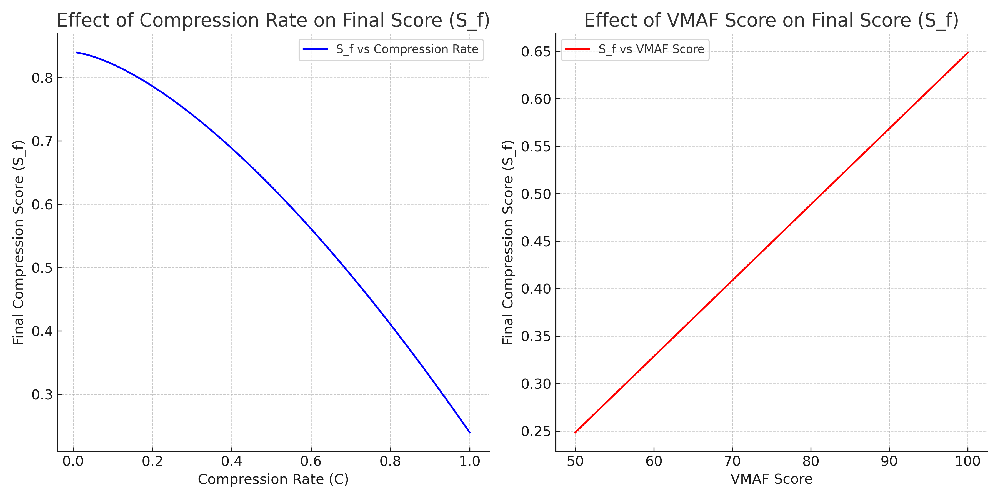

 # VIDAIO Subnet Validation & Incentive Mechanism

## Table of Contents
- [Overview](#overview)
- [Task Types](#task-types)
  - [Upscaling Tasks](#upscaling-tasks)
  - [Compression Tasks](#compression-tasks)
- [Quality Validation Metrics](#quality-validation-metrics)
  - [VMAF (Video Multi-Method Assessment Fusion)](#vmaf-video-multi-method-assessment-fusion)
  - [PIE-APP (Perceptual Image-Error Assessment)](#pie-app-perceptual-image-error-assessment-through-pairwise-preference)
- [Upscaling System](#upscaling-system)
  - [Upscaling Scoring](#upscaling-scoring)
  - [Content Length Scoring](#content-length-scoring)
  - [Upscaling Final Score](#upscaling-final-score)
  - [Upscaling Penalty & Bonus System](#upscaling-penalty--bonus-system)
- [Compression System](#compression-system)
  - [Compression Scoring](#compression-scoring)
  - [Compression Penalty & Bonus System](#compression-penalty--bonus-system)
- [Emission Weighting & Burn](#emission-weighting--burn)
- [Implementation Guidelines](#implementation-guidelines)
- [Technical Specifications](#technical-specifications)
- [Mathematical Properties](#mathematical-properties)

---

## Overview

The VIDAIO subnet validation mechanism ensures quality and reliability of miners' contributions through comprehensive assessment systems for different video processing tasks. The mechanism evaluates video processing performance using industry-standard **VMAF** and **PIE-APP** metrics, combined with advanced scoring systems that reward consistency and penalize poor performance.

**Key Features:**
- 🎯 **Multi-task support** for upscaling and compression operations
- 📊 **Quality validation** using industry-standard VMAF and PIE-APP metrics
- 🏆 **Performance-based incentive systems** with exponential rewards
- 📈 **Historical performance tracking** with rolling 10-round windows
- ⚖️ **Balanced penalty/bonus multipliers** encouraging sustained excellence
- 📦 **Dynamic content processing** (5s and 10s currently supported)

---

## Task Types

### Upscaling Tasks

Upscaling tasks require miners to enhance video quality by increasing resolution while maintaining or improving visual fidelity. These tasks focus on **quality improvement** as the primary objective.

**Key Characteristics:**
- **Primary Goal**: Quality enhancement and resolution improvement
- **Quality Metrics**: PIE-APP for scoring, VMAF for threshold validation
- **Content Length**: Dynamic processing durations (5s and 10s currently supported)
- **Scoring Focus**: Quality improvement with content length consideration

### Compression Tasks

Compression tasks require miners to reduce video file sizes while maintaining quality above specified VMAF thresholds. These tasks focus on **efficiency optimization** balancing file size reduction with quality preservation.

**Key Characteristics:**
- **Primary Goal**: File size reduction with quality maintenance
- **Quality Metrics**: VMAF for both scoring and threshold validation
- **Compression Rate**: File size reduction efficiency measurement
- **Scoring Focus**: Compression efficiency with quality threshold compliance

---

## Quality Validation Metrics

### VMAF (Video Multi-Method Assessment Fusion)

VMAF serves as the foundational video quality assessment metric, comparing frame-by-frame quality between original and processed videos. This metric provides objective measurement of subjective video quality as perceived by humans.

#### Key Characteristics
- **Purpose**: Frame-by-frame quality comparison
- **Range**: 0-100 (higher values indicate better quality)
- **Usage**: Threshold validation and quality scoring
- **Industry Standard**: Widely adopted in professional video processing

#### Mathematical Implementation

**Harmonic Mean Calculation:**
```
H = n / (1/S_1 + 1/S_2 + ... + 1/S_n)
```

**Where:**
- `S_i`: VMAF score for frame `i` (i = 1, 2, ..., n)
- `n`: Total number of frames in the video
- `H`: Harmonic mean emphasizing poor-quality frame impact

#### Why Harmonic Mean?

The harmonic mean approach provides several critical advantages:

| Advantage | Description | Impact |
|-----------|-------------|---------|
| **Sensitivity to Low Values** | Heavily penalizes poor-quality frames | Ensures consistent quality |
| **Quality Consistency** | Prevents miners from neglecting frame quality | Maintains processing standards |
| **Threshold Function** | Validates authentic processing processes | Prevents gaming attempts |

> **Note**: VMAF sampling depends on task and scoring path. Compression uses full-video VMAF by default through the Docker/libvmaf path; its Y4M fallback samples the configured frame count. Upscaling uses a sampled Docker/libvmaf path with random skip/subsample parameters, and its Y4M fallback samples the configured frame count. The current fallback sample count is 10 frames.

---

### PIE-APP (Perceptual Image-Error Assessment through Pairwise Preference)

PIE-APP provides deep learning-based perceptual similarity assessment between original and processed video frames, serving as the primary quality scoring mechanism for upscaling tasks.

#### Technical Specifications

| Parameter | Value | Description |
|-----------|-------|-------------|
| **Scale Range** | (-∞, ∞) | Theoretical range |
| **Practical Range** | 0 to 2 after cap | Positive values (lower = better) |
| **Processing Interval** | Every sampled frame | Calculated over the selected sample window |
| **Implementation** | Deep learning-based | Advanced perceptual assessment |

#### Calculation Process

**Step 1: Raw PIE-APP Score**
```
PIE-APP_score = (Σ abs(d(F_i, F'_i))) / n
```

**Where:**
- `F_i`: Frame `i` from original video
- `F'_i`: Corresponding frame `i` from processed video  
- `d(F_i, F'_i)`: Perceptual difference between frames
- `n`: Number of processed frames (4 consecutive frames from a randomly selected start)

**Step 2: Score Normalization**
```
1. Cap values: min(Average_PIE-APP, 2.0)
2. Sigmoid normalization: normalized_score = 1/(1+exp(-Average_PIE-APP))
3. Final transformation: Convert "lower is better" to "higher is better" (0-1 range)
```

#### Visual Score Transformation

The PIE-APP scoring system uses sophisticated mathematical transformations:

- *Sigmoid normalization function for PIE-APP scores*
!

- *Final score transformation converting to 0-1 range*
!

---

## Upscaling System

### Upscaling Scoring

#### Quality Score Calculation

**VMAF Threshold Validation:**
```
If VMAF_score < VMAF_threshold:
    S_Q = 0 (Zero score for quality violation)
Else:
    S_Q = PIE-APP_Final_Score
```

**Where:**
- `S_Q`: Quality score for upscaling
- `VMAF_score`: Achieved VMAF quality score
- `VMAF_threshold`: Minimum required VMAF score
- `PIE-APP_Final_Score`: Normalized PIE-APP score (0-1 range)

#### Metric Integration

| Metric | Range | Primary Function | Usage |
|--------|-------|------------------|-------|
| **VMAF** | 0-100 | Threshold validation | Upscaling verification |
| **PIE-APP** | 0-1 (final) | Quality scoring | Performance evaluation |

---

### Content Length Scoring

#### Dynamic Content Length Requests

Miners report their maximum supported upscaling content length through `LengthCheckProtocol`. The validator currently requests either 5-second or 10-second chunks; responses above 5 seconds are mapped to 10 seconds.

#### Available Processing Durations

| Duration | Status | Availability |
|----------|--------|--------------|
| 5s | ✅ Default | Currently available |
| 10s | ✅ Available | Currently available |
| 20s+ | 🔄 Not protocol-enabled | Future release |

> **Current Limitation**: The active protocol only exposes 5-second and 10-second upscaling content lengths. The length-score formula still normalizes against 320 seconds as a long-term scoring ceiling.

#### Length Score Mathematical Model

**Formula:**
```
S_L = log(1 + content_length) / log(1 + 320)
```

**Parameters:**
- `content_length`: Processing duration in seconds
- `S_L`: Normalized length score (0 to 1)

#### Length Score Curve Reference

| Duration (s) | S_L Score | Percentage | Improvement | Performance Tier |
|--------------|-----------|------------|-------------|------------------|
| 5 | 0.3105 | 31.05% | Baseline | Default |
| 10 | 0.4155 | 41.55% | +33% | Significant Gain |
| 20 | 0.5275 | 52.75% | +27% | Strong Performance |
| 40 | 0.6434 | 64.34% | +22% | High Capability |
| 80 | 0.7614 | 76.14% | +18% | Advanced Processing |
| 160 | 0.8804 | 88.04% | +16% | Expert Level |
| 320 | 1.0000 | 100.00% | +14% | Maximum Score |

Only 5-second and 10-second durations are currently reachable through the active protocol. Longer rows show the retained normalization curve for future protocol expansion.

#### Logarithmic Scaling Benefits

| Benefit | Description | Impact |
|---------|-------------|---------|
| **Fair Distribution** | Balanced scoring across duration ranges | Equitable competition |
| **Diminishing Returns** | Reduced gains for extreme durations | Prevents over-optimization |
| **Normalized Output** | Consistent 0-1 scoring range | Standardized evaluation |
| **Capacity Recognition** | Rewards longer processing capabilities | Incentivizes advancement |

**Strategic Insights:**
- **Optimal Entry Point**: 10s processing provides largest relative improvement (+33%)
- **Scaling Pattern**: Each duration doubling yields progressively smaller benefits
- **Maximum Achievement**: 320s processing represents the retained theoretical scoring ceiling, not current protocol availability

---

### Upscaling Final Score

#### Score Component Architecture

The comprehensive upscaling scoring system integrates two fundamental metrics:

| Component | Symbol | Description | Weight |
|-----------|--------|-------------|--------|
| **Quality Score** | S_Q | Processing accuracy and output quality | W1 = 0.5 |
| **Length Score** | S_L | Content processing capacity | W2 = 0.5 |

#### Preliminary Score Calculation

**Formula:**
```
S_pre = S_Q × W1 + S_L × W2
```

**Current Configuration:**
- `W1 = 0.5` (Quality weight)
- `W2 = 0.5` (Length weight)

> **Current Behavior**: Weights are fixed at 0.5 and 0.5 in the current scoring service. Dynamic adjustment is listed as a future enhancement.

#### Final Score Transformation

The preliminary score undergoes exponential transformation for enhanced performance differentiation:

**Formula:**
```
S_F = 0.1 × e^(6.979 × (S_pre - 0.5))
```

**Parameters:**
- `S_F`: Final upscaling score
- `S_pre`: Preliminary combined score
- `e`: Euler's number (≈2.718)

#### Performance Tier Analysis

| S_pre | S_F Score | Multiplier | Performance Tier | Reward Category |
|-------|-----------|------------|------------------|-----------------|
| 0.30 | 0.0248 | 0.25× | Poor Performance | Significant Penalty |
| 0.36 | 0.0376 | 0.38× | Below Average | Moderate Penalty |
| 0.42 | 0.0572 | 0.57× | Low Average | Minor Penalty |
| 0.48 | 0.0870 | 0.87× | Near Average | Slight Penalty |
| 0.54 | 0.1322 | 1.32× | Above Average | Moderate Reward |
| 0.60 | 0.2010 | 2.01× | Good Performance | Strong Reward |
| 0.66 | 0.3055 | 3.05× | High Performance | Major Reward |
| 0.72 | 0.4643 | 4.64× | Very High Performance | Excellent Reward |
| 0.78 | 0.7058 | 7.06× | Excellent Performance | Outstanding Reward |
| 0.84 | 1.0728 | 10.73× | Outstanding Performance | Elite Reward |
| 0.90 | 1.6307 | 16.31× | Elite Performance | Maximum Reward |

#### Exponential Function Characteristics

**System Benefits:**
| Feature | Description | Strategic Impact |
|---------|-------------|------------------|
| **Enhanced Differentiation** | Clear performance tier separation | Competitive advantage clarity |
| **Reward Amplification** | 16× multiplier difference (top vs bottom) | Strong performance incentives |
| **Competitive Optimization** | Non-linear improvement rewards | Encourages continuous advancement |
| **Exponential Scaling** | Small S_pre gains yield large S_F improvements | High-performance focus |

**Strategic Performance Guidelines:**
- **Minimum Target**: Achieve S_pre > 0.6 for meaningful reward activation
- **Optimization Focus**: Exponential curve creates powerful excellence incentives
- **High-Performance Strategy**: Small quality improvements at elevated levels yield disproportionate benefits

#### Graph Analysis

!

---

### Upscaling Penalty & Bonus System

#### Historical Performance Multiplier Architecture

The advanced upscaling scoring system incorporates a **rolling 10-round historical performance window** to evaluate consistency patterns and apply dynamic multipliers based on sustained performance trends.

#### System Formula

```
Final Adjusted Score = S_F × Performance Multiplier
Performance Multiplier = Bonus Multiplier × S_F Penalty × S_Q Penalty
```

---

#### Bonus System (Excellence Rewards)

**Activation Criteria:** `S_F > 0.32` in mining round

**Mathematical Model:**
```python
bonus_multiplier = 1.0 + (bonus_count / 10) × 0.15
```

**System Characteristics:**
| Parameter | Value | Description |
|-----------|-------|-------------|
| **Maximum Bonus** | +15% | All 10 rounds achieve S_F > 0.32 |
| **Scaling Method** | Linear | Based on consistency frequency |
| **Primary Purpose** | Sustained excellence reward | Long-term performance incentive |

**Example Calculation:** 7/10 rounds with S_F > 0.32 → 1.105× multiplier (+10.5% bonus)

---

#### S_F Penalty System (Performance Penalties)

**Activation Criteria:** `S_F < 0.07` in mining round

**Mathematical Model:**
```python
penalty_f_multiplier = 1.0 - (penalty_f_count / 10) × 0.20
```

**System Characteristics:**
| Parameter | Value | Description |
|-----------|-------|-------------|
| **Maximum Penalty** | -20% | All 10 rounds achieve S_F < 0.07 |
| **Scaling Method** | Linear | Based on poor performance frequency |
| **Primary Purpose** | Performance consistency enforcement | Discourages sustained poor results |

**Example Calculation:** 4/10 rounds with S_F < 0.07 → 0.92× multiplier (-8% penalty)

---

#### S_Q Penalty System (Quality Penalties)

**Activation Criteria:** `S_Q < 0.50` in mining round

**Mathematical Model:**
```python
penalty_q_multiplier = 1.0 - (penalty_q_count / 10) × 0.25
```

**System Characteristics:**
| Parameter | Value | Description |
|-----------|-------|-------------|
| **Maximum Penalty** | -25% | All 10 rounds achieve S_Q < 0.50 |
| **Scaling Method** | Linear | Based on quality failure frequency |
| **Primary Purpose** | Quality standard enforcement | Strongest penalty (quality is critical) |

**Example Calculation:** 3/10 rounds with S_Q < 0.50 → 0.925× multiplier (-7.5% penalty)

---

#### Performance Multiplier Case Studies

| Miner Category | Avg S_F | Avg S_Q | Bonus Rate | S_F Penalty | S_Q Penalty | **Final Multiplier** | **Net Effect** |
|----------------|---------|---------|------------|-------------|-------------|---------------------|----------------|
| **Elite Miner** | 0.854 | 0.717 | 10/10 | 0/10 | 0/10 | **1.150×** | **+15.0%** |
| **Good Miner** | 0.653 | 0.571 | 0/10 | 0/10 | 0/10 | **1.000×** | **±0.0%** |
| **Average Miner** | 0.511 | 0.505 | 0/10 | 0/10 | 3/10 | **0.925×** | **-7.5%** |
| **Poor Miner** | 0.311 | 0.411 | 0/10 | 10/10 | 10/10 | **0.600×** | **-40.0%** |

#### Penalty Analysis

!

---

#### System Benefits & Strategic Impact

**Core System Benefits:**

| Benefit | Description | Strategic Impact |
|---------|-------------|------------------|
| 🎯 **Consistency Rewards** | Elite miners maintain sustained +15% bonus | Long-term competitive advantage |
| ⚡ **Responsive Penalties** | Poor performance accumulates immediate penalties | Rapid feedback mechanism |
| 🔄 **Recovery Incentive** | Miners can improve multipliers over 10 rounds | Encourages continuous improvement |
| ⚖️ **Balanced Impact** | Quality penalties are strongest (-25% max) | Emphasizes quality importance |
| 📈 **Progressive Scaling** | Linear scaling prevents extreme swings | Maintains system stability |

---

## Compression System

### Compression Scoring

#### Task Parameters

Each compression task includes specific requirements:

| Parameter | Description | Range | Impact |
|-----------|-------------|-------|---------|
| **VMAF Threshold** | Minimum acceptable quality score | 0-100 | Quality validation |
| **Original File Size** | Baseline for compression calculation | Variable | Compression rate baseline |
| **Target Optimization** | Balance between compression and quality | Dynamic | Performance strategy |

#### Compression Rate Calculation

**Formula:**
```
C = compressed_file_size / original_file_size
```

**Where:**
- `C`: Compression rate (0 < C ≤ 1)
- `compressed_file_size`: Size of processed video file
- `original_file_size`: Size of original video file

**Characteristics:**
- **Lower C values** indicate better compression (smaller files)
- **C = 1.0** means no compression achieved
- **C < 1.0** indicates successful compression

#### VMAF Quality Assessment

**Implementation:**
```
VMAF_score = Harmonic_Mean(VMAF_frame_1, VMAF_frame_2, ..., VMAF_frame_n)
```

**Where:**
- `VMAF_frame_i`: VMAF score for frame `i`
- `n`: Number of evaluated frames. Compression uses full-video VMAF by default; fallback scoring uses the configured sample count.
- `Harmonic_Mean`: Emphasizes poor-quality frame impact

#### Final Compression Score Calculation

Compression scoring first converts the compression rate into a compression ratio:
```
R = 1 / C
hard_cutoff = VMAF_threshold - 5
normalization_factor = 1.12
```

**Hard Fail Conditions:**
```
If C >= 0.80:
    S_f = 0

If VMAF_score < hard_cutoff:
    S_f = 0
```

The first rule requires at least 1.25x compression. The second rule rejects outputs that are more than 5 VMAF points below the target threshold.

**Soft Zone: `hard_cutoff <= VMAF_score < VMAF_threshold`**
```
soft_zone_position = (VMAF_score - hard_cutoff) / 5
quality_factor = 0.7 × soft_zone_position^2

If R <= 20:
    compression_component = ((R - 1) / 19)^1.5
Else:
    compression_component = 1.0 + 0.3 × ln(R / 20)

S_f = min(1.0, compression_component × quality_factor / 1.12)
```

**At or Above Threshold: `VMAF_score >= VMAF_threshold`**
```
quality_component = 0.7 + 0.3 × min(1.0, (VMAF_score - VMAF_threshold) / (100 - VMAF_threshold))

If R <= 20:
    compression_component = ((R - 1.25) / 18.75)^0.9
Else:
    compression_component = 1.0 + 0.1 × ln(R / 20)

S_f = min(1.0, (0.7 × compression_component + 0.3 × quality_component) / 1.12)
```

**Parameters:**
- `S_f`: Final compression score
- `w_c`: Weight for compression rate (default: 0.7)
- `w_vmaf`: Weight for VMAF score (default: 0.3)
- `C`: Compression rate
- `R`: Compression ratio
- `VMAF_score`: Achieved VMAF quality score
- `VMAF_threshold`: Minimum required VMAF score

#### Mathematical Properties

**Compression Rate Component:**
- **Formula**: Piecewise function over compression ratio `R`
- **Minimum Requirement**: `C < 0.80` (at least 1.25x compression)
- **Standard Range**: Ratio scoring up to `R = 20`
- **Exceptional Compression**: Logarithmic bonus above `R = 20`

**VMAF Quality Component:**
- **Hard Cutoff**: `VMAF_score < VMAF_threshold - 5` produces zero score
- **Soft Zone**: Quadratic recovery between `VMAF_threshold - 5` and `VMAF_threshold`
- **Above Threshold**: Linear quality component from `0.7` at threshold to `1.0` at VMAF 100
- **Integration**: Above-threshold score blends `70%` compression component and `30%` quality component

#### Graph Analysis

!

---

#### Performance Analysis Examples

| Scenario | C | R | VMAF_score | VMAF_threshold | S_f | Result |
|----------|---|---|------------|----------------|-----|--------|
| **Above threshold, strong quality** | 0.3 | 3.33x | 85 | 70 | **0.3142** | Success |
| **Above threshold, moderate compression** | 0.5 | 2.00x | 80 | 70 | **0.2488** | Success |
| **Above threshold, light compression** | 0.7 | 1.43x | 75 | 70 | **0.2104** | Success |
| **Soft zone recovery** | 0.3 | 3.33x | 68 | 70 | **0.0097** | Low score |
| **Below hard cutoff** | 0.3 | 3.33x | 64 | 70 | **0.0000** | Failed |
| **No meaningful compression** | 1.0 | 1.00x | 90 | 70 | **0.0000** | Failed |

#### Strategic Guidelines

| Miner Strategy | Focus Area | Target Metrics | Expected Outcome |
|----------------|------------|---------------|------------------|
| **Quality-First** | Maintain high VMAF scores | VMAF_score >> VMAF_threshold | Consistent moderate scores |
| **Compression-First** | Maximize file size reduction | C << 1.0 | Variable scores based on quality |
| **Balanced Approach** | Optimize both factors | Moderate C + Good VMAF | Optimal long-term performance |
| **Threshold Gaming** | Minimal quality compliance | VMAF_score ≈ VMAF_threshold | Low scores, high risk |

---

### Compression Penalty & Bonus System

#### Historical Performance Multiplier Architecture

The compression scoring system incorporates a **rolling 10-round historical performance window** to evaluate consistency patterns and apply dynamic multipliers based on sustained performance trends.

#### System Formula

```
Final Adjusted Compression Score = S_f × Performance Multiplier
Performance Multiplier = Bonus Multiplier × S_f Penalty
```

Compression quality is already included in `S_f` through the VMAF hard cutoff, soft recovery zone, and above-threshold quality component. The current implementation does not apply a separate VMAF history penalty multiplier for compression.

---

#### Bonus System (Excellence Rewards)

**Activation Criteria:** `S_f > 0.74` in compression mining round

**Mathematical Model:**
```python
bonus_multiplier = 1.0 + (bonus_count / 10) × 0.15
```

**System Characteristics:**
| Parameter | Value | Description |
|-----------|-------|-------------|
| **Maximum Bonus** | +15% | All 10 rounds achieve S_f > 0.74 |
| **Scaling Method** | Linear | Based on consistency frequency |
| **Primary Purpose** | Sustained excellence reward | Long-term performance incentive |

**Example Calculation:** 7/10 rounds with S_f > 0.74 → 1.105× multiplier (+10.5% bonus)

---

#### S_f Penalty System (Performance Penalties)

**Activation Criteria:** `S_f < 0.4` in compression mining round

**Mathematical Model:**
```python
penalty_f_multiplier = 1.0 - (penalty_f_count / 10) × 0.20
```

**System Characteristics:**
| Parameter | Value | Description |
|-----------|-------|-------------|
| **Maximum Penalty** | -20% | All 10 rounds achieve S_f < 0.4 |
| **Scaling Method** | Linear | Based on poor performance frequency |
| **Primary Purpose** | Performance consistency enforcement | Discourages sustained poor results |

**Example Calculation:** 4/10 rounds with S_f < 0.4 → 0.92× multiplier (-8% penalty)

---

#### Compression Performance Multiplier Case Studies

| Miner Category | Avg S_f | Bonus Rate | S_f Penalty | **Final Multiplier** | **Net Effect** |
|----------------|---------|------------|-------------|----------------------|----------------|
| **Elite Compressor** | 0.78 | 10/10 | 0/10 | **1.150×** | **+15.0%** |
| **Good Compressor** | 0.50 | 0/10 | 0/10 | **1.000×** | **±0.0%** |
| **Average Compressor** | 0.31 | 0/10 | 10/10 | **0.800×** | **-20.0%** |
| **Recovering Compressor** | 0.42 | 0/10 | 4/10 | **0.920×** | **-8.0%** |

#### Compression Penalty Analysis

**Strategic Impact:**
- **Quality compliance** is enforced inside `S_f` through VMAF cutoff and soft-zone scoring
- **Consistency rewards** for miners maintaining strong compression scores
- **Immediate feedback** through zero-score for quality violations
- **Balanced optimization** encouraged through dual-factor scoring

---

## Emission Weighting & Burn

The final incentive layer is implemented in `vidaio_subnet_core/validating/managing/miner_manager.py` through the `MinerManager.weights` property. This layer converts accumulated miner scores into on-chain weights, allocates the miner pool across compression and upscaling, starts each task pool from equal top-five rank shares, optionally weighs those non-zero shares by alpha stake and recent emission liquidation behavior, and applies the configured burn proportion to the miner emission pool. The current burn proportion is `0.0`, so no miner emissions are burned by default.

### Eligible Miner Set

Only miners with a valid `accumulate_score` and a recognized `processing_task_type` participate in the emission calculation. Validators, identified by metagraph `validator_permit`, and miners with `accumulate_score == -1` are excluded before ranking.

Eligible miners are separated by task type and ranked by `accumulate_score` in descending order inside their own task pools. Compression receives 80% of the pre-burn miner pool and upscaling receives 20%.

The miner metadata table also stores each miner UID's current `alpha_stake`. This value is synced from the Bittensor metagraph `alpha_stake` vector, exposed by the SDK as `metagraph.alpha_stake` / `metagraph.AS`, alongside the existing hotkey, coldkey, IP, and port metadata.

The miner manager also maintains a rolling `miner_emission_epoch_snapshots` table to estimate recent emission liquidation behavior. Each snapshot includes the miner UID, hotkey, coldkey, task type, epoch block, epoch index, alpha stake, metagraph emission value, and timestamp. Snapshot rows are recorded once per `(uid, epoch_index)` and the first observation in that tempo epoch is retained. Rows older than the configured 10-epoch window are pruned so the table does not grow indefinitely.

### Top-Five Distribution

Each task pool starts from an equal split among its top five miners:

| Rank | Share of task pool |
|------|---------------------|
| 1 | 20% |
| 2 | 20% |
| 3 | 20% |
| 4 | 20% |
| 5 | 20% |
| 6+ | 0% |

Rank determines eligibility. When both optional weigh factors are `0.0`, all five eligible ranks receive the same share. Miners ranked 6 or lower in their task pool receive zero miner-side emission weight for that round.

Before burn, this produces the following task-specific allocations:

| Bucket | Rank 1 | Rank 2 | Rank 3 | Rank 4 | Rank 5 | Rank 6+ |
|--------|--------|--------|--------|--------|--------|---------|
| Compression pool (80%) | 16% | 16% | 16% | 16% | 16% | 0% |
| Upscaling pool (20%) | 4% | 4% | 4% | 4% | 4% | 0% |

### Alpha Stake Weighing

After the base top-five allocation, the miner manager can optionally weigh miner-side allocations according to each non-validator miner's alpha stake proportion inside the same task pool. This behavior is controlled by:

```python
alpha_stake_weigh_factor = CONFIG.score.alpha_stake_weigh_factor
```

When the factor is `0.0`, the equal top-five split is preserved exactly. When the factor is greater than zero, only miners that already have a non-zero base allocation participate in the alpha stake weighing. In practice, this means only the top five compression miners and top five upscaling miners are eligible. Validators are excluded before this calculation, and miners ranked 6 or lower keep zero emission weight even if they have alpha stake.

For each task pool, the weighing calculation uses alpha stake proportions among that task pool's non-zero recipients:

```text
alpha_share_i = alpha_stake_i / sum(alpha_stake_top_nonzero_task_pool)
raw_weighted_weight_i = base_weight_i * (1 + alpha_stake_weigh_factor * alpha_share_i)
```

The weighted values are then normalized back to the same task-pool total. This preserves the configured compression/upscaling allocation and configured burn amount while shifting the top-five distribution toward miners with larger alpha stake.

Example final weights with `burn_proportion = 0.0` and top-five alpha stakes `[150, 100, 600, 1600, 20]`:

| Rank | Alpha stake | Alpha stake share | Compression, factor 0 | Compression, factor 2 | Compression, factor 5 | Upscaling, factor 0 | Upscaling, factor 2 | Upscaling, factor 5 |
|------|-------------|-------------------|-----------------------|-----------------------|-----------------------|---------------------|---------------------|---------------------|
| 1 | 150 | 6.07% | 16.00% | 12.82% | 10.43% | 4.00% | 3.20% | 2.61% |
| 2 | 100 | 4.05% | 16.00% | 12.35% | 9.62% | 4.00% | 3.09% | 2.40% |
| 3 | 600 | 24.29% | 16.00% | 16.98% | 17.72% | 4.00% | 4.25% | 4.43% |
| 4 | 1600 | 64.78% | 16.00% | 26.23% | 33.91% | 4.00% | 6.56% | 8.48% |
| 5 | 20 | 0.81% | 16.00% | 11.61% | 8.32% | 4.00% | 2.90% | 2.08% |
| Task-pool miner total | 2470 | 100.00% | 80.00% | 80.00% | 80.00% | 20.00% | 20.00% | 20.00% |

The burn UID receives 0% in all factor settings. The factor changes only the distribution among the non-zero top-five miners inside the task pool.

### Recent Emission Liquidation Weighing

After the alpha stake weighing pass, the miner manager can apply a second optional pass based on each miner's estimated proportion of recent emissions liquidated over the rolling snapshot window. This behavior is controlled by:

```python
emission_liquidation_weigh_factor = CONFIG.score.emission_liquidation_weigh_factor
emission_liquidation_window_epochs = CONFIG.score.emission_liquidation_window_epochs
```

The window defaults to 10 retained tempo-epoch snapshots. Epoch boundaries use `metagraph.tempo` when available, falling back to `CONFIG.SUBNET_TEMPO`. The first retained snapshot is used as the alpha stake baseline, so a 10-snapshot window provides up to 9 comparable settled emission intervals. The weigh factor defaults to `5.0`. Setting the factor to `0.0` disables this liquidation weighing layer.

For each top-five non-validator recipient in a task pool, the miner manager reads up to the latest 10 `miner_emission_epoch_snapshots` rows and estimates:

```text
first_excluded_emission_i = first_snapshot.emission
total_recent_emission_i = sum(snapshot.emission over snapshots after the first boundary)
alpha_stake_delta_i = max(0, last_alpha_stake_i - first_alpha_stake_i)
retained_emission_i = min(alpha_stake_delta_i, total_recent_emission_i)
liquidated_emission_i = max(0, total_recent_emission_i - retained_emission_i)
liquidated_proportion_i = liquidated_emission_i / total_recent_emission_i
retained_proportion_i = 1 - liquidated_proportion_i
```

The first boundary emission is excluded because the rolling window does not include the previous alpha stake baseline needed to compare it. Emissions after the first boundary are treated as settled interval emissions and are compared with the alpha stake change across the same window. The positive weigh signal is the retained side of the calculation. A positive `emission_liquidation_weigh_factor` therefore shifts weight toward miners that appear to retain more of their recent emissions as alpha stake:

```text
raw_weighted_weight_i = alpha_weighted_weight_i * (
    1 + emission_liquidation_weigh_factor * retained_proportion_i
)
```

The raw values are normalized back to the same task-pool total, preserving the configured compression/upscaling allocation and configured burn amount.

If a miner has fewer than two snapshots or no recent settled emissions in the comparable window, the miner manager assumes the miner liquidated 50% of recent emissions. In the formula this means `liquidated_proportion_i = 0.5` and `retained_proportion_i = 0.5` until enough history exists. If the whole task pool is missing history, every top-five miner receives the same fallback signal, so the liquidation weighing pass leaves the split unchanged after normalization.

Example final weights with `burn_proportion = 0.0`, no alpha stake weighing, and top-five recent liquidation percentages `[40%, 20%, 70%, 10%, 100%]`:

| Rank | Liquidated | Retained signal | Compression, factor 0 | Compression, factor 2 | Compression, factor 5 | Upscaling, factor 0 | Upscaling, factor 2 | Upscaling, factor 5 |
|------|------------|-----------------|-----------------------|-----------------------|-----------------------|---------------------|---------------------|---------------------|
| 1 | 40% | 60% | 16.00% | 17.25% | 17.78% | 4.00% | 4.31% | 4.44% |
| 2 | 20% | 80% | 16.00% | 20.39% | 22.22% | 4.00% | 5.10% | 5.56% |
| 3 | 70% | 30% | 16.00% | 12.55% | 11.11% | 4.00% | 3.14% | 2.78% |
| 4 | 10% | 90% | 16.00% | 21.96% | 24.44% | 4.00% | 5.49% | 6.11% |
| 5 | 100% | 0% | 16.00% | 7.84% | 4.44% | 4.00% | 1.96% | 1.11% |
| Task-pool miner total | n/a | n/a | 80.00% | 80.00% | 80.00% | 20.00% | 20.00% | 20.00% |

When both `alpha_stake_weigh_factor = 5.0` and `emission_liquidation_weigh_factor = 5.0`, using top-five alpha stakes `[150, 100, 600, 1600, 20]` and recent liquidation percentages `[40%, 20%, 70%, 10%, 100%]`, the final weights are:

| Rank | Alpha stake | Liquidated | Alpha-only factor 5, compression | Both factors 5, compression | Alpha-only factor 5, upscaling | Both factors 5, upscaling |
|------|-------------|------------|----------------------------------|-----------------------------|--------------------------------|---------------------------|
| 1 | 150 | 40% | 10.43% | 10.15% | 2.61% | 2.54% |
| 2 | 100 | 20% | 9.62% | 11.70% | 2.40% | 2.92% |
| 3 | 600 | 70% | 17.72% | 10.77% | 4.43% | 2.69% |
| 4 | 1600 | 10% | 33.91% | 45.36% | 8.48% | 11.34% |
| 5 | 20 | 100% | 8.32% | 2.02% | 2.08% | 0.51% |
| Task-pool miner total | 2470 | n/a | 80.00% | 80.00% | 20.00% | 20.00% |

### Emissions Burn

After the top-five allocations and optional alpha stake and emission liquidation weighing are calculated, the miner manager applies a configured burn proportion to the miner emission pool. The current configuration is:

```python
burn_proportion = 0.0
```

This means no calculated miner emissions are assigned to the subnet owner UID returned by `get_burn_uid()`, while 100% stays with the ranked miners.

The burn is applied after ranking, the base top-five split, any alpha stake weighing, and any emission liquidation weighing:

```text
pre_burn_weight_i = weighted top-five allocation for miner i
miner_weight_i = pre_burn_weight_i * (1 - burn_proportion)
burn_weight = burn_proportion * sum(pre_burn_weights)
```

With `burn_proportion = 0.0`, `alpha_stake_weigh_factor = 0.0`, and `emission_liquidation_weigh_factor = 0.0`, the effective on-chain distribution is:

| Recipient bucket | Effective final allocation |
|------------------|----------------------------|
| Compression rank 1 | 16% |
| Compression rank 2 | 16% |
| Compression rank 3 | 16% |
| Compression rank 4 | 16% |
| Compression rank 5 | 16% |
| Upscaling rank 1 | 4% |
| Upscaling rank 2 | 4% |
| Upscaling rank 3 | 4% |
| Upscaling rank 4 | 4% |
| Upscaling rank 5 | 4% |
| Ranks 6+ in either task pool | 0% |
| Burn UID / subnet owner UID | 0% |

The task allocation, base top-five split, optional alpha stake weighing, and optional emission liquidation weighing are applied before the burn. Therefore, only the top five compression miners and top five upscaling miners can receive non-zero miner-side emissions; all other miner-side emission is zeroed before the remaining eligible miner emissions are scaled by `1 - burn_proportion`.

---

## Implementation Guidelines

### Performance Monitoring

**Real-time Operations:**
- ✅ Scores calculated in real-time during mining operations
- ✅ Historical performance data maintained for trend analysis and multiplier calculation
- ✅ Fixed scoring weights applied consistently by the scoring service
- ✅ Performance multipliers updated after each mining round

### Scoring Strategy Recommendations

**Upscaling Performance-Based Guidelines:**

| Miner Category | Primary Focus | Strategic Recommendations |
|----------------|---------------|---------------------------|
| **New Miners** | Foundation Building | Focus on achieving consistent S_pre > 0.5 before optimizing for length |
| **Established Miners** | Quality Optimization | Prioritize quality improvements when S_pre > 0.6 to avoid S_Q penalties |
| **Elite Miners** | Consistency Maintenance | Maintain consistency above S_F > 0.32 to secure maximum bonus multipliers |
| **Recovery Phase** | Systematic Improvement | Focus on quality (S_Q >= 0.50) first, then performance (S_F >= 0.07) to restore multipliers |

**Compression Performance-Based Guidelines:**

| Miner Category | Primary Focus | Strategic Recommendations |
|----------------|---------------|---------------------------|
| **New Compressors** | Quality Compliance | Meet the requested VMAF threshold and avoid the hard cutoff at VMAF_threshold - 5 |
| **Established Compressors** | Balanced Optimization | Optimize both compression rate and quality maintenance |
| **Elite Compressors** | Consistency Excellence | Maintain S_f > 0.74 consistently for bonus multipliers |
| **Recovery Phase** | Quality Restoration | Focus on VMAF compliance first, then compression optimization |

### Future Enhancement Roadmap

**Planned Developments:**

- [ ] **Extended Content Length Support** - Processing durations beyond the current 5s and 10s protocol options
- [ ] **Dynamic Weight Adjustment Algorithms** - Automated optimization based on network performance
- [ ] **Advanced Quality Metrics Integration** - Additional assessment parameters
- [ ] **Multi-dimensional Scoring Parameters** - Enhanced evaluation criteria
- [ ] **Adaptive Difficulty Scaling** - Network performance-based adjustments
- [ ] **Advanced Penalty/Bonus Optimization** - Network-wide performance distribution analysis
- [ ] **Seasonal Performance Multiplier Adjustments** - Time-based optimization cycles
- [ ] **Cross-Task Performance Integration** - Unified scoring across upscaling and compression

---

## Technical Specifications

### Core System Parameters

| Parameter | Current Value | Configurable Range | Implementation Notes |
|-----------|---------------|-------------------|---------------------|
| **Default Content Length** | 5s | 5s - 10s | Actively configurable by miners |
| **Quality Weight (W1)** | 0.5 | 0.0 - 1.0 | Fixed in current scoring service |
| **Length Weight (W2)** | 0.5 | 0.0 - 1.0 | Fixed in current scoring service |
| **Emission Burn Proportion** | 0.0 | Miner manager setting | No miner emissions are burned by default |
| **Compression Emission Allocation** | 80% | Miner manager setting | Compression pool before burn and top-five split |
| **Upscaling Emission Allocation** | 20% | Miner manager setting | Upscaling pool before burn and top-five split |
| **Emission Rank Shares** | 20%, 20%, 20%, 20%, 20% | Miner manager setting | Base shares applied separately inside compression and upscaling; only ranks 1-5 in each task pool receive non-zero miner-side emission weight |
| **Alpha Stake Weigh Factor** | 5.0 | `CONFIG.score.alpha_stake_weigh_factor` | Optional task-pool-local weighing for non-validator top-five miners, normalized to preserve each task pool's total allocation |
| **Emission Liquidation Weigh Factor** | 5.0 | `CONFIG.score.emission_liquidation_weigh_factor` | Optional task-pool-local weighing toward miners with lower estimated recent liquidation and higher retained emission proportion |
| **Emission Liquidation Window** | 10 snapshots | `CONFIG.score.emission_liquidation_window_epochs` | Number of recent tempo-epoch snapshots retained in `miner_emission_epoch_snapshots`; the first retained snapshot is the alpha baseline, so 10 snapshots provide up to 9 comparable emission intervals |

### Compression System Parameters

| Parameter | Current Value | Configurable Range | Implementation Notes |
|-----------|---------------|-------------------|---------------------|
| **Compression Rate Weight (w_c)** | 0.7 | Fixed | Above-threshold blend weight for compression component |
| **VMAF Score Weight (w_vmaf)** | 0.3 | Fixed | Above-threshold blend weight for quality component |
| **Compression Rate Curves** | Piecewise by ratio | Fixed | Uses separate soft-zone and above-threshold compression curves |
| **Soft Threshold Margin** | 5 VMAF points | Fixed | Enables soft recovery from VMAF_threshold - 5 to VMAF_threshold |
| **No-Compression Cutoff** | C >= 0.80 | Fixed | Requires at least 1.25x compression |
| **Zero-Score Quality Cutoff** | VMAF_score < VMAF_threshold - 5 | Fixed | Immediate penalty for severe quality violations |

### Performance Multiplier System Parameters

| Parameter | Current Value | Configurable Range | System Impact |
|-----------|---------------|-------------------|---------------|
| **Performance History Window** | 10 rounds | 5-10 rounds | Configurable for different network conditions |
| **Upscaling Bonus Threshold** | S_F > 0.32 | 0.3-0.4 | Adjustable based on network performance |
| **Upscaling S_F Penalty Threshold** | S_F < 0.07 | Hardcoded in miner manager | Penalty for very poor upscaling final scores |
| **Upscaling S_Q Penalty Threshold** | S_Q < 0.50 | Hardcoded in miner manager | Penalty for weak upscaling quality scores |
| **Compression Bonus Threshold** | S_f > 0.74 | 0.7-0.8 | Lower threshold reflecting compression difficulty |
| **Compression S_f Penalty Threshold** | S_f < 0.4 | 0.35-0.45 | Penalty for poor compression performance |
| **Separate Compression Quality Penalty** | Not active | N/A | Compression quality is included directly in S_f |
| **Maximum Bonus** | +15% | 10%-20% | Scalable reward system |
| **Maximum S_F Penalty** | -20% | 15%-25% | Scalable penalty system |
| **Maximum S_Q Penalty** | -25% | 20%-30% | Strongest penalty for quality issues |

---

## Mathematical Properties

### Upscaling Length Score Function Properties

**Mathematical Characteristics:**
- **Current Domain**: [5, 10] seconds
- **Formula Ceiling**: 320 seconds
- **Current Range**: [0.3105, 0.4155]
- **Function Type**: Logarithmic (concave)
- **Growth Rate**: Decreasing marginal returns
- **Optimization Point**: Balanced between processing capability and diminishing returns

### Upscaling Final Score Function Properties

**Mathematical Characteristics:**
- **Domain**: [0, 1] (S_pre values)
- **Range**: [0.0031, 3.2770] over S_pre in [0, 1]
- **Function Type**: Exponential (convex)
- **Critical Point**: S_pre = 0.5 (inflection point for reward/penalty)
- **Scaling Behavior**: Exponential amplification of performance differences

### Compression Score Function Properties

**Mathematical Characteristics:**
- **Domain**: `0 < C < 0.80` for non-zero compression scoring
- **Ratio Definition**: `R = 1 / C`
- **Function Type**: Piecewise compression-ratio scoring with logarithmic bonus above 20x
- **Critical Point**: `C >= 0.80` produces zero score
- **Optimization**: Higher compression ratios yield higher compression components with controlled exceptional-compression bonuses

### Compression VMAF Component Properties

**Mathematical Characteristics:**
- **Hard Cutoff**: VMAF_score < VMAF_threshold - 5
- **Soft Zone**: [VMAF_threshold - 5, VMAF_threshold)
- **Above-Threshold Range**: [VMAF_threshold, 100]
- **Soft-Zone Function**: Quadratic quality factor recovery
- **Above-Threshold Function**: Linear quality component from 0.7 to 1.0
- **Quality Integration**: Included directly in S_f rather than as a separate compression history multiplier

### Performance Multiplier Properties

**Mathematical Characteristics:**
- **Upscaling Domain**: [0.60, 1.15]
- **Compression Domain**: [0.80, 1.15]
- **Function Type**: Linear combination of historical performance frequencies
- **Update Frequency**: After each mining round completion
- **Memory System**: Rolling 10-round window with automatic history management
- **Convergence**: Stabilizes after 10 rounds of consistent performance patterns

---

## Conclusion

The VIDAIO subnet validation and incentive mechanism represents a comprehensive, mathematically-grounded approach to ensuring high-quality video processing while maintaining fair competition and encouraging continuous improvement. Through the integration of industry-standard metrics (VMAF and PIE-APP), dynamic scoring systems, and sophisticated penalty/bonus mechanisms, the system creates a robust environment that rewards excellence and consistency while providing clear pathways for improvement.

The system now supports both **upscaling** and **compression** tasks, each with specialized scoring mechanisms:
- **Upscaling tasks** focus on quality improvement using PIE-APP scoring with VMAF threshold validation
- **Compression tasks** balance file size reduction with quality maintenance using dual-factor scoring
- **Unified penalty systems** ensure consistent quality standards across all task types

These metrics together ensure that miners maintain high-quality video processing standards while meeting demands for fast and efficient processing, creating a sustainable and competitive ecosystem for video enhancement and optimization services.

---

*This documentation is continuously updated to reflect the latest scoring mechanisms, performance optimizations, and system enhancements.*
